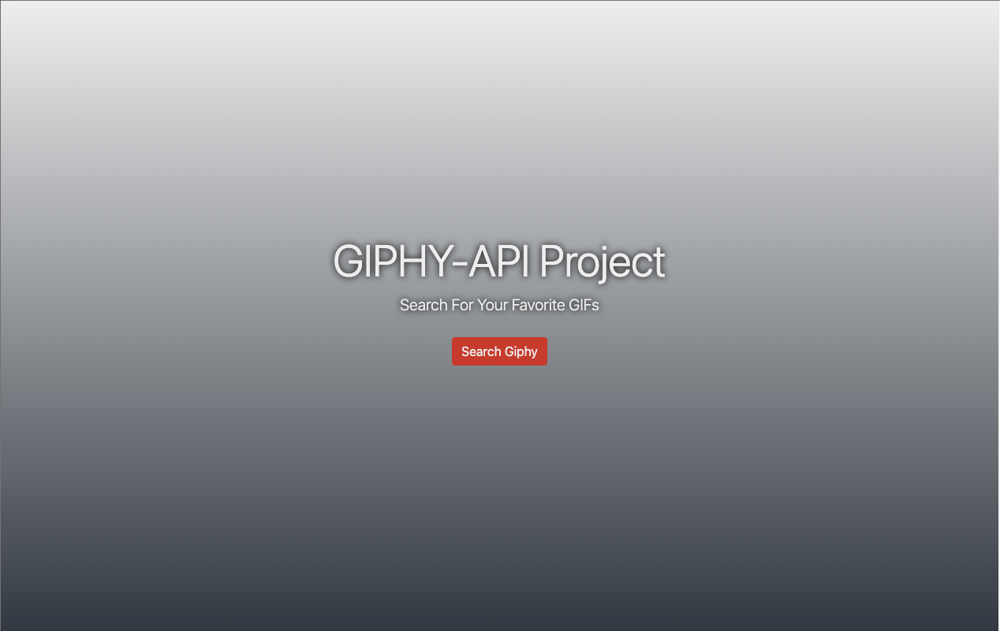
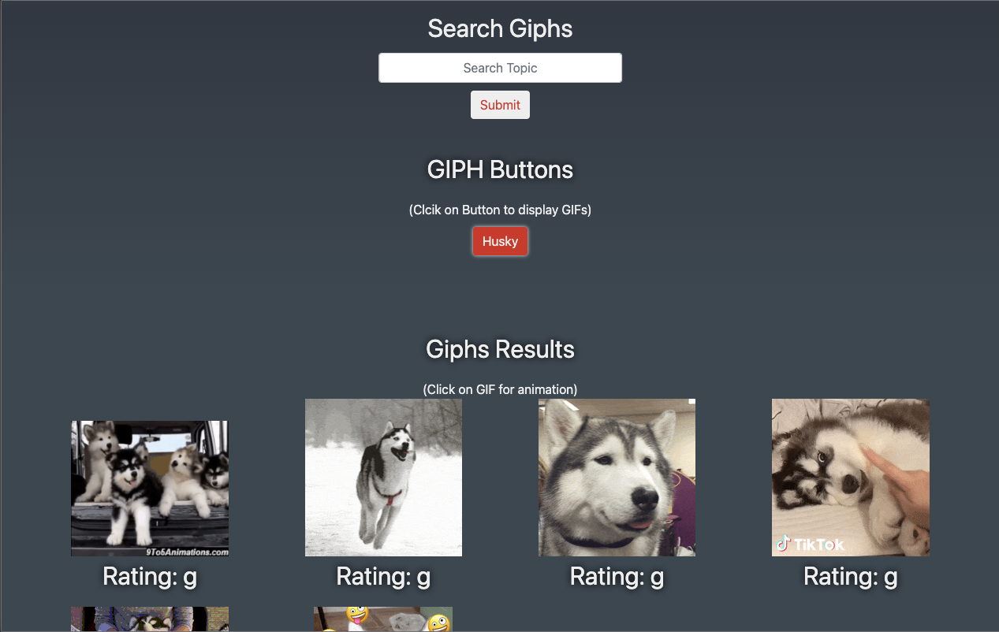

<!-- Title -->

<br />


  <h3 align="center">GIPHY API Project</h3>

  <p align="center">
    A starter API Application
    <br />
    <br />
    <a href="">View Demo</a>
  </p>
</p>


<!-- TABLE OF CONTENTS -->
<details open="open">
  <summary>Table of Contents</summary>
  <ol>
    <li>
      <a href="#about-the-project">About The Project</a>
      <ul>
        <li><a href="#built-with">Built With</a></li>
      </ul>
    </li>
    <li>
      <a href="#getting-started">Getting Started</a>
      <ul>
        <li><a href="#installation">Installation</a></li>
      </ul>
    </li>
    <li><a href="#contact">Contact</a></li>
    <li><a href="#acknowledgements">Acknowledgements</a></li>
  </ol>
</details>
<br/>
<br/>


<!-- ABOUT THE PROJECT -->
## About The Project


<br>

<br/>
<br/>


This project was one of my starter projects for API.

Here's why:
* This project helps build on the Javascript foundation.
* Provides insight on how to acquire and utilize API Keys and the type of data that needs to be extracted.
* 


### Built With

The following frameworks were used to complete the project.
* [HTML5](https://developer.mozilla.org/en-US/docs/Web/Guide/HTML/HTML5)
* [Bootstrap](https://getbootstrap.com)
* [Javascript](https://www.javascript.com/)
* [JQuery](https://jquery.com)
* [GIPHY API](https://developers.giphy.com/)


<!-- GETTING STARTED -->
## Getting Started

The project can either viewed at this link [enterprojectdemolink]('projectlink) or the code can be cloned onto a local machine with the steps below.


### Installation

1. Get a free API Key at [https://developers.giphy.com/](https://example.com)
2. Clone the repo
   ```sh
   git clone https://github.com/aamir-malik22188/giphy-api-project.git
   ```
3. Install NPM packages
   ```sh
   npm install
   ```
4. Create a `config.js` file.
5. Enter your API key in `config.js` with the following format.
   ```JS
   var config = {
    myKey : '&api_key={ENTER_API_KEY_HERE}&limit=10'
    }
   ```
6. Start project.


<!-- CONTACT -->
## Contact


Aamir Malik - Aamir22188@gmail.com

Project Repo: https://github.com/aamir-malik22188/giphy-api-project

Twitter Handle: [@TheRealAamir](https://twitter.com/TheRealAamir)

<!-- ACKNOWLEDGEMENTS -->
## Acknowledgements
* [GIPHY API for Developers](https://developers.giphy.com/)
* [W3 Schools](https://www.w3schools.com/)
* [Google Fonts](https://fonts.google.com/)
* [SMU Bootcamp](https://techbootcamps.smu.edu/)


